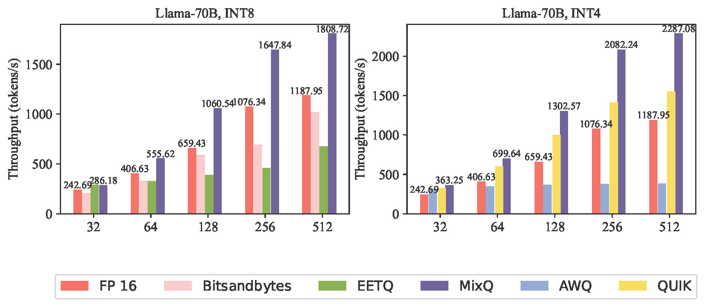
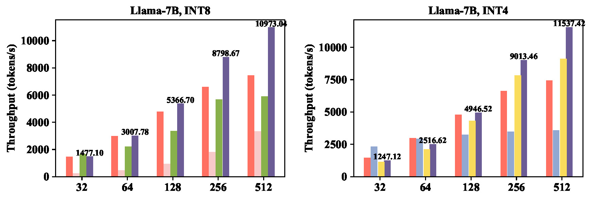

# Project For lenovo

Please clone the project
```
git clone https://github.com/ucascnic/lianxiangTRT.git
```

Please Pull the docker 

```
docker pull registry.cn-hangzhou.aliyuncs.com/dongdongchen/dongdong:v1
```

Please run the docker

```
 srun  -N 1 --pty --gres=gpu:a100:4 -A h100 -p a100  docker run --rm -it   --ipc=host -p 6789:22 -v /home/chenyidong/lianxiang/lianxiangTRT:/code/tensorrt_llm  \
            -v /home/chenyidong/checkpoint:/code/checkpoint  \
            -v /home/chenyidong/dataset:/code/dataset  \
             --ulimit memlock=-1 --ulimit    stack=67108864             \
            --gpus=all       \
            --env "CCACHE_DIR=/code/tensorrt_llm/cpp/.ccache"            \
            --env "CCACHE_BASEDIR=/code/tensorrt_llm"                

```

Please setup the env  by

cd /code/tensorrt_llm
source load.sh

Please run FP16 baseline with Llama-2-7B by

```
bash fp16.sh

```


Please run optimized model  Llama-2-7B by

```
bash com.sh

```


Please run optimized model  with Llama-2-70B by

```
bash commpi.sh

```

## benchmark

The pytoch benchmark is shown in compare.ipynb

Please run the flowing script to reproduce the benchmark of AWQ MIXQ bitsandbytes FP16

``` cd MixQ/src ```


Run:

``` bash runthroughput.sh 0 ```

For Llama-2-70B model:




For Llama-2-7B model:


