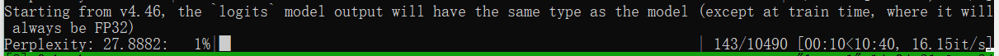
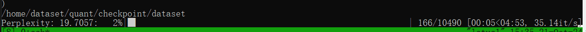
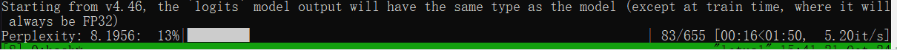
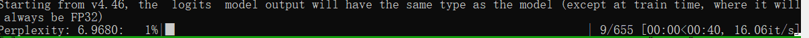
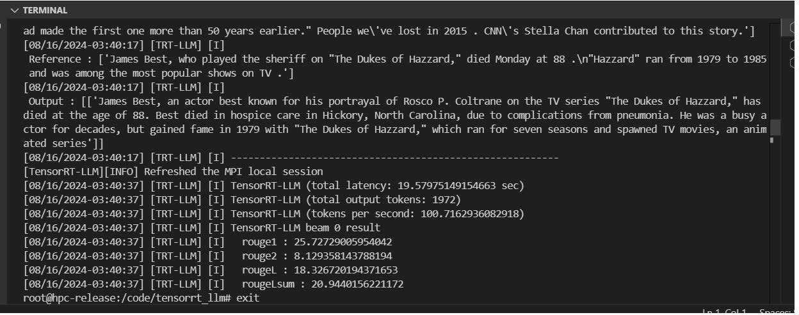

# Mixed-Precision Inference with Text Generation Demo by TensorRT-LLM 

The project implemented the mixed-precsion inferece in TensorRT-LLM.


## Comparision with AWQ

Assuming we have a task that is to compute the PPL(perplexity) of Wikitext2. 
The dataset wikitext contains 333088 validation data.

For ```batch size  = 32```, the task is devided into 10409 parts.

AWQ finished the task in 10 minutes with  16.71 it/s.



MixQ (W8A8O16)   finished the task in 4.50 minutes with 35.02 it/s.



For ```batch size  = 512```, the task is devided into 655 parts.

AWQ finished the task in 127 seconds with  5.2 it/s.



MixQ (W8A8O16) finished the task in 30 seconds with 21.34 it/s.



We write the tensorrt plugging in [TsinghuaMixQPlugin.cpp](https://github.com/Qcompiler/MixQ_Tensorrt_LLM/blob/main/TsinghuaMixQPlugin.cpp)

Please clone the project
```
git clone https://github.com/Qcompiler/MixQ_Tensorrt_LLM.git
```

Please Pull the docker 

```
docker pull registry.cn-hangzhou.aliyuncs.com/dongdongchen/dongdong:v1
```

Please run the docker

```
bash -c " nvidia-smi; docker run --rm -it --ipc=host -p 6789:22 \
-v /home/chenyidong/lianxiang/lianxiangTRT/:/code/tensorrt_llm   \
-v  /mnt/octave/data/chenyidong/checkpoint:/dataset    \
-v /home/chenyidong/checkpoint:/code/checkpoint \
-v /mnt/octave/data/chenyidong/lianxiang/checkpoint:/octave/checkpoint \
               --ulimit memlock=-1 --ulimit    stack=67108864             \
                           --gpus=all       \
                       --env 'CCACHE_DIR=/code/tensorrt_llm/cpp/.ccache'            \
                            --env 'CCACHE_BASEDIR=/code/tensorrt_llm'              \
                                                    --workdir /app/tensorrt_llm     \
                                                            --hostname hpc-release \
                  --name tensorrt_llm-release-zhanghy                             \
                                                           --tmpfs /tmp:exec      \
              registry.cn-hangzhou.aliyuncs.com/dongdongchen/dongdong:v1     "

```

Please setup the enviroment  by

```
cd /code/tensorrt_llm
source load.sh
```

## Examples of Qwen2 with Mixed-Precision Inference

We have provided a script `mix.sh` for you. And please quantize and run the model step by step;

Quantize the model by:

```
export models=qwen2-7b-instruct
export ngpu=1
export type=mix
export model_dir=/dataset/${model}
export quant_dir=/octave/checkpoint/checkpoint${type}/tllm_checkpoint_${ngpu}gpu_fp16${model}
export out_dir=/octave/checkpoint/checkpoint${type}/tllm_checkpoint_${ngpu}gpu_fp16${model}

 
CUDA_VISIBLE_DEVICES=$1  python  quantize_qwen.py --model_dir  ${model_dir} --output_dir  ${quant_dir}  --dtype float16             --load_model_on_cpu   --mix int8_mix   
```

Build the TensorRT-LLM Engine with mixed-precision plugging by

```
CUDA_VISIBLE_DEVICES=$1 trtllm-build --checkpoint_dir ${quant_dir} \
    --output_dir ${out_dir} --max_input_len  2048 \
        --gemm_plugin float16 
```

Run the TensorRT-LLM Engine with mixed-precision inference by

```
CUDA_VISIBLE_DEVICES=$1   python  summarize.py --test_trt_llm \
                    --hf_model_dir ${model_dir} \
                    --data_type fp16 \
                    --engine_dir ${out_dir}
    
```

The output is




## Benchmark

We have tested the throughput with Pytorch:

For Llama-2-70B model:


For Llama-2-7B model:


For a detailed benchmark, please refer to the pytoch benchmark in :
https://github.com/Qcompiler/MIXQ

